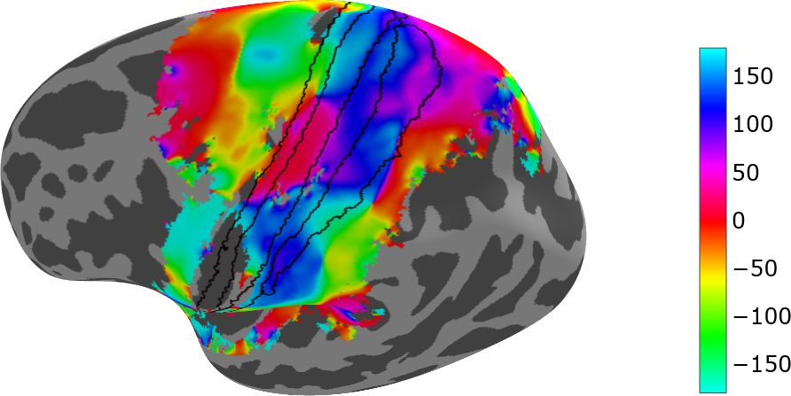
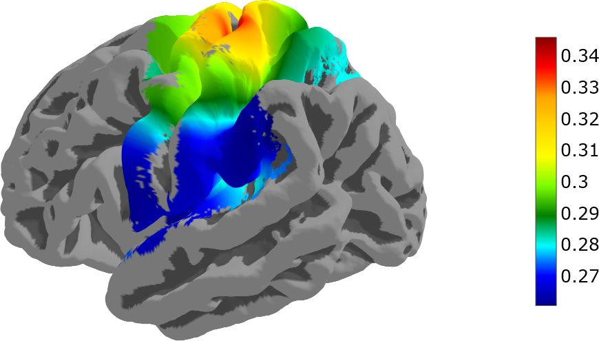
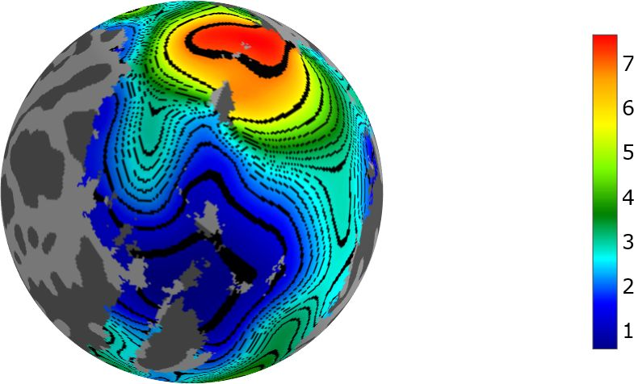
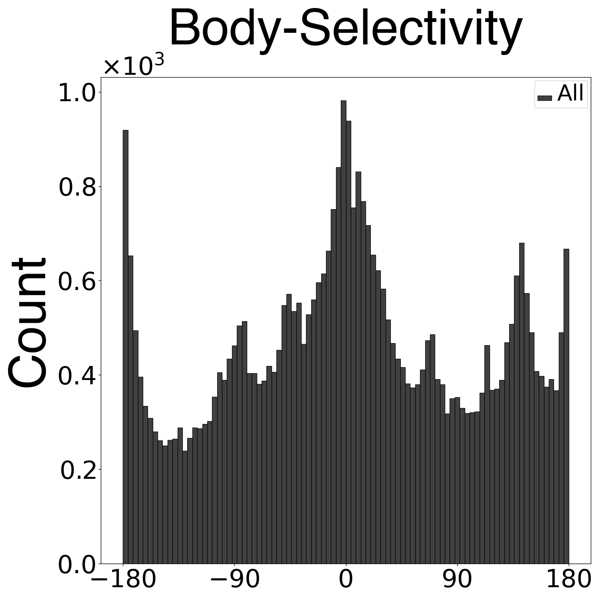

# The geometry of somatosensory representations in the cortex

Repository for paper "The geometry of somatosensory representations in the cortex"
## Abstract
The well-known body map of the primary somatosensory cortex (S1), known as the homunculus, is spatially organized such that cortical areas sensitive to body parts, from head to toes, are organized from lateral to medial. Another way of characterizing somatosensory responses in the cortex is to consider them in the framework of the hierarchical nature of somatosensory information processing. Moving from rostral to caudal within S1, cortical responses become less selective, more bilateral, and more complex. This approximate orthogonality of body and hierarchy directions may allow the cortex to process information about each body part at multiple hierarchy levels. Body maps and hierarchies have also been identified in other regions in the somatosensory cortex. However, the geometric relationships between body representation and hierarchy have remained unclear because a unified description of these measures across the entire cortex has been lacking. Here we used functional MRI to characterize cortical responses to full-body light touch stimulation. We show that the orthogonal relationship between body representation and hierarchy in S1, does not generalize to the entire somatosensory cortex. Rather, it is a pinhole observation of a radial geometry of both the body representations and the hierarchy. Our findings are consistent with established body maps and hierarchies, but offers a holistic, macroscopic view of the organization of these maps  with respect to each other. Similar organizational patterns in the visual and auditory systems suggest that radial topography may be a common feature across sensory systems.

[arXiv](https://www.biorxiv.org/content/10.1101/2024.07.11.603013v1) | [BibTeX](#bibtex)



*body-selectivity angles between gradient maps left hemisphere inflated*

## Code
main function to calculate angle maps between body selectivity and laterality is in gradient_maps.py.
The functions uses selectivity with 800 smooth factor, laterality with 400 and body with 200.
The python script draw_data_map.py is a tool for presenting data maps in 3D using nilearm.



*Selectivity map left hemisphere pial*

## draw_data_map.py
draw_data_map.py is a wrapper for draw_surface function in nilearn. It is used to draw surface maps of data.
```bash
python draw_data_map.py --help
```

```
usage: draw_data_map    [--mapName MAPNAME]
                        [--hemi {lh,rh}]
                        [--fname FNAME]
                        [--cmap CMAP]
                        [--surf {multi,infl,pial,flat}]
                        [--sigInd SIGIND]
                        [--interData]
                        [--vMin VMIN]
                        [--vMax VMAX]
                        [--threshold THRESHOLD]
                        [--title TITLE]
                        [--colorbar | --no-colorbar]

Wrapper for draw_surface function. Draws a surface map of data

options:
  --mapName MAPNAME     Name of the map to draw
  --hemi {lh,rh}        Side of the brain
  --fname FNAME         Name of the file to save the map to
  --cmap CMAP           Colormap to use
  --surf {multi,infl,pial,flat}
                        Surface to draw on
  --sigInd SIGIND       Indices of significant voxels
  --interData           Interpolate data to 1-8
  --vMin VMIN           Minimum value of the colormap
  --vMax VMAX           Maximum value of the colormap
  --threshold THRESHOLD
                        Threshold value for the colormap
  --title TITLE         Title of the map
  --colorbar, --no-colorbar
                        Draw a colorbar (default: True)
  --contour, --no-contour
                        Add contour lines (default: False)
```



*body map left hemisphere sphere*

## data_analysis.py
data_analysis.py is a notebook that contains the analysis of the data. It is used to show the 3 maps (Selectivity, Laterality and body) in different smooth parameters with mask caluclated using maxR or Random Effect. It will also show the angle maps between the 3 maps.

Other options include: Contour lines, Glasser parcellation, histograms, circular mean and std 

## nilearn
To support non symmetrical data around 0 we made changes to the nilearn library and is available in the nilearn folder.

## Data
Subjects fMRI data is available at
[https://openneuro.org/datasets/ds003089/versions/1.0.1](https://openneuro.org/datasets/ds003089/versions/1.0.1)



*body selectivity histogram left hemisphere*

## Acknowledgements
We thank Shahar Arzy for his support and Matthias Kaschube for fruitful discussions. We 
thank Simon Eickhoff for his critical insights regarding the representation in the secondary 
somatosensory cortex. We thank the ELSC MRI unit, Assaf Yohalashet, Lee Ashkenazi and 
Yuval Porat for their dedicated work.

## Funding
This work was supported by the Gatsby Charitable Foundation and a grand from the DFG 
(CRC 1080). YL Y.L. is the incumbent of the David and Inez Myers Chair in Neural
Computation.

## BibTeX
```
@article {Saadon-Grosman2024.07.11.603013,
	author = {Saadon-Grosman, Noam and Asher, Tsahi and Loewenstein, Yonatan},
	title = {On the Geometry of Somatosensory Representations in the Cortex},
	elocation-id = {2024.07.11.603013},
	year = {2024},
	doi = {10.1101/2024.07.11.603013},
	publisher = {Cold Spring Harbor Laboratory},
	URL = {https://www.biorxiv.org/content/early/2024/07/16/2024.07.11.603013},
	eprint = {https://www.biorxiv.org/content/early/2024/07/16/2024.07.11.603013.full.pdf},
	journal = {bioRxiv}
}
```